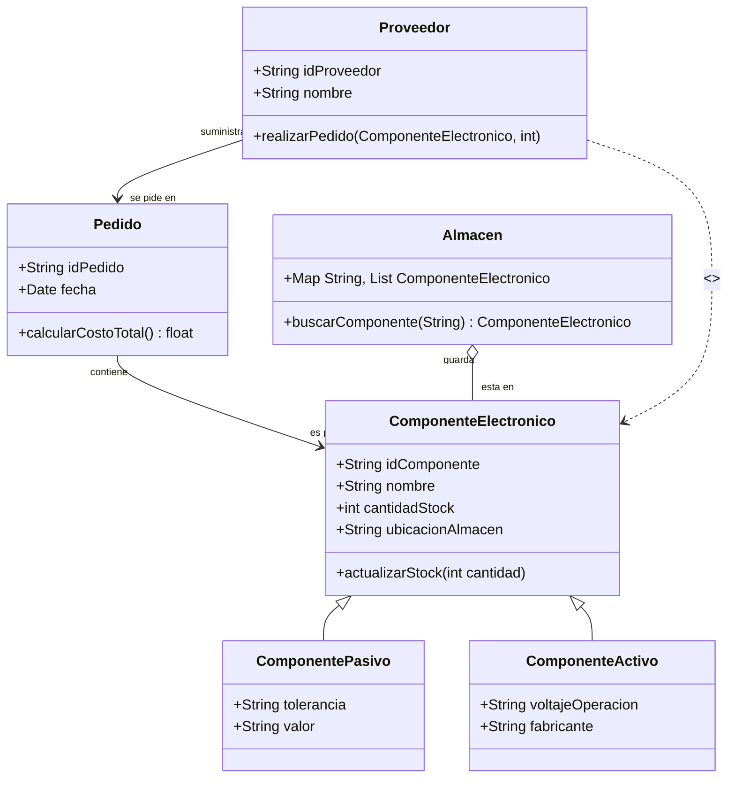

# Reto2-POO
Un diagrama de clases sobre componentes electrónicos y su distribución al puro estilo temu y se me paso la fecha :´(

EXPLICACION DIAGRAMA

El diagrama UML para el sistema de gestión de componentes electrónicos modela un entorno donde se organizan piezas como resistencias, capacitores y microcontroladores, junto con sus proveedores, pedidos y almacenamiento. La clase ComponenteElectronico define atributos comunes, mientras que sus subclases ComponentePasivo y ComponenteActivo añaden detalles específicos. Otras clases como Proveedor, los proveedores realizan pedidos, los pedidos contienen componentes, y el almacén los organiza. Las relaciones estructuran cómo interactúan estas entidades, asegurando trazabilidad y escalabilidad. La estructura jerárquica y las relaciones claras permiten adaptar el sistema a nuevos componentes o proveedores sin modificar su núcleo.

